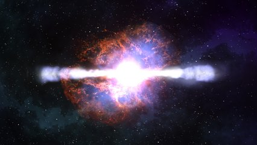

# Antimatéria e Matéria

Marquinhos (12 anos) chega em casa e fala pro seu irmão mais velho:

- Lá no consultório do dentista, vi numa revista que existe antimatéria! Ela destrói toda matéria que toca e os dois desaparecem.

O irmão mais velho responde alfinetando:

- Saquei, então você é o meu irmão antimatéria. Toda vez que você vai brincar, você quebra tudo que toca e some!

Marquinhos, indignado, propôs ao seu irmão "sabido" o seguinte desafio: imagine duas palavras, a primeira será a "matéria" e a segunda a "antimatéria". Quando as duas se encontram, se o final da primeira palavra for igual ao começo da segunda, essa parte correspondente é aniquilada.

Sua tarefa é criar um programa que simule essa colisão. Dadas duas palavras, encontre a maior sobreposição entre o final da primeira e o começo da segunda e una as duas, removendo a parte aniquilada.

### Entrada

- Duas palavras, uma por linha.

### Saída

- A palavra resultante da colisão.

### Restrições

- As palavras conterão apenas letras minúsculas.

## Exemplos

<!-- tests tests.toml --limit 3 -->
<table><tr><th><code>Entrada</code></th><th><code>Saída</code></th></tr>
<!-- INPUT --><tr><td valign="top"><pre>
mel
lema
</pre></td>
<!-- OUTPUT --><td valign="top"><pre>
a
</pre></td></tr>
<!-- INPUT --><tr><td valign="top"><pre>
pegasus
suspiro
</pre></td>
<!-- OUTPUT --><td valign="top"><pre>
pegapiro
</pre></td></tr>
<!-- INPUT --><tr><td valign="top"><pre>
olho
ohio
</pre></td>
<!-- OUTPUT --><td valign="top"><pre>
olio
</pre></td></tr>
</table>
<!-- end -->
