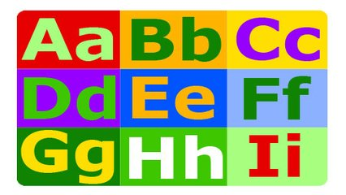

# Avestruz com Alcaparras - ignorar case

## Contexto

Conte quantas vezes o caractere aparece na frase ignorando case.

### Entrada

* Uma frase de até 100 caracteres e uma letra.

### Saída

* O número de vezes que a letra aparece na frase.

## Exemplos
<!-- tests tests.toml --limit 3 -->
<!-- end -->
