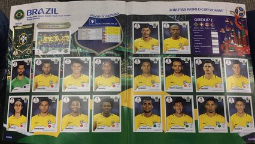

# Figurinhas repetidas

Baruel Ruel tem muitas figurinhas do álbum de futebol. Ele estava indo para uma feira de troca de figurinhas quando tropeçou e misturou as figurinhas todas. Ele não sabe mais quais figurinhas estão repetidas e tem pra trocar, nem quais estão faltando pra completar a coleção. Ajude Baruel Ruel com essa tarefa.

### Entrada

- linha 1: Um inteiro representando a quantidade total de figurinhas do álbum (1 a 50).
- linha 2: Um inteiro representando a quantidade de figurinhas que Baruel possui (1 a 100).
- linha 3: Uma sequência de inteiros representando os números das figurinhas que Baruel possui, em **ORDEM CRESCENTE**.

### Saída

- Linha 1: Os números das figurinhas que estão repetidas.
- Linha 2: Os números das figurinhas que estão faltando no álbum.

## Exemplos

<!-- tests tests.toml --limit 3 -->
<table><tr><th><code>Entrada</code></th><th><code>Saída</code></th></tr>
<!-- INPUT --><tr><td valign="top"><pre>
5
8
1 1 1 1 2 2 3 5
</pre></td>
<!-- OUTPUT --><td valign="top"><pre>
[ 1 1 1 2 ]
[ 4 ]
</pre></td></tr>
<!-- INPUT --><tr><td valign="top"><pre>
2
4
1 1 2 2
</pre></td>
<!-- OUTPUT --><td valign="top"><pre>
[ 1 2 ]
[ ]
</pre></td></tr>
<!-- INPUT --><tr><td valign="top"><pre>
5
2
4 5
</pre></td>
<!-- OUTPUT --><td valign="top"><pre>
[ ]
[ 1 2 3 ]
</pre></td></tr>
</table>
<!-- end -->
