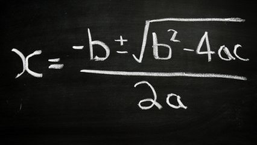

# Usando biblioteca matemática

## Contexto

Não sei se você amava ou odiava o tal do Bhaskara por inventar aquela fórmula das raízes. Agora é hora de implementar aquela conta pra nunca ter mais que fazer na mão.

Formula de bhaskara:

$$x = \frac{-b \pm \sqrt{\Delta}}{2a}$$

Cálculo do Delta:

$$\Delta = b^2 - 4ac$$

Dados os valores de A, B e C, calcule as raízes.

### Entrada

- Valores de A, B e C em ponto flutuante, um por linha.

### Saída

- Caso Δ seja positivo: exiba as duas raízes com duas casas decimais, uma em cada linha.
- Caso Δ seja igual a zero: exiba a única raiz com duas casas decimais.
- Caso Δ seja negativo: exiba a mensagem "nao ha raiz real".

## Exemplos

<!-- tests tests.toml --limit 3 -->
<table><tr><th><code>Entrada</code></th><th><code>Saída</code></th></tr>
<!-- INPUT --><tr><td valign="top"><pre>
5.4
25.0
-12.0
</pre></td>
<!-- OUTPUT --><td valign="top"><pre>
0.44
-5.07
</pre></td></tr>
<!-- INPUT --><tr><td valign="top"><pre>
3.0
-7.0
4.0
</pre></td>
<!-- OUTPUT --><td valign="top"><pre>
1.33
1.00
</pre></td></tr>
<!-- INPUT --><tr><td valign="top"><pre>
9.0
-12.0
4.0
</pre></td>
<!-- OUTPUT --><td valign="top"><pre>
0.67
</pre></td></tr>
</table>
<!-- end -->
