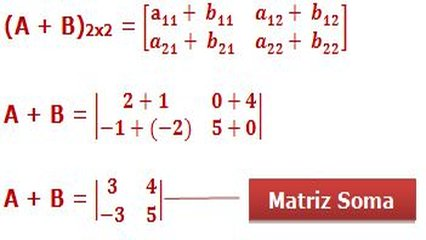

# Soma de elementos de em uma matriz

- Mamãe me perguntou: Tem certeza que tu não tá escondendo alguma nota baixa?
- Tudo deu 10 no meu boletim, mãe!
- Como assim, tudo deu 10?
- Matemática 3, Português 4, Ciências 2, História 1, Geografia 0, Inglês 0. Somando dá 10!

Sua tarefa é criar um programa que, inspirando-se nessa lógica, receba uma matriz 2x3 de notas inteiras e retorne a soma de todos os seus elementos.

### Entrada

- Uma matriz 2x3 de números inteiros. Cada linha da matriz será fornecida em uma nova linha de entrada, com os números separados por espaços.

### Saída

- A soma de todos os valores da matriz.

### Restrições

- A matriz de entrada será sempre do tamanho 2x3.

## Exemplos

<!-- tests tests.toml --limit 3 -->
<table><tr><th><code> Entrada </code>
</th><th><code>Saída</code>
</th></tr><tr><td valign="top"><pre>
1 2 3
4 5 6
</pre></td><td valign="top"><pre>
21
</pre></td></tr></table>

<table><tr><th><code> Entrada </code>
</th><th><code>Saída</code>
</th></tr><tr><td valign="top"><pre>
1 1 1
1 1 1
</pre></td><td valign="top"><pre>
6
</pre></td></tr></table>

<table><tr><th><code> Entrada </code>
</th><th><code>Saída</code>
</th></tr><tr><td valign="top"><pre>
5 2 1
3 2 1
</pre></td><td valign="top"><pre>
14
</pre></td></tr></table>
<!-- end -->
