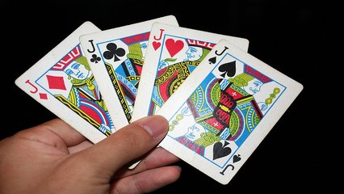

# Transformando números em letras

## Contexto

Você está jogando um jogo de cartas com seus amigos e, ao olhar para sua mão, percebe que os números das cartas estão codificados. Querendo saber quais cartas realmente possui, você decide converter esses números em letras e ver sua mão de forma clara.

No jogo:

- O número **1** corresponde à carta **"A"** (Ás).
- Os números **11**, **12** e **13** correspondem às cartas **"J"**, **"Q"** e **"K"** (Valete, Rainha e Rei), respectivamente.
- Os outros números permanecem os mesmos.

Leia um vetor contendo a mão de cartas de um jogador e mostre as cartas para o usuário de forma legível, substituindo os números especiais **(1, 11, 12, 13)** por suas respectivas letras.

### Entrada

- A primeira linha contém um número inteiro **N** (0 ≤ N ≤ 13) representando a quantidade de cartas na mão.
- A segunda linha contém **N** números inteiros representando as cartas do jogador, separados por espaço. Os valores estão entre **1** e **13**.

### Saída

- Imprima o vetor das cartas formatado entre colchetes `[ ]`, onde cada carta é separada por uma vírgula e um espaço. Substitua os números **1**, **11**, **12** e **13** por **"A"**, **"J"**, **"Q"** e **"K"**, respectivamente.

## Restrições

- O número de cartas **N** estará entre 0 e 13.
- Os valores das cartas estarão entre 1 e 13.

## Exemplos

<!-- tests tests.toml --limit 3 -->
<!-- end -->
