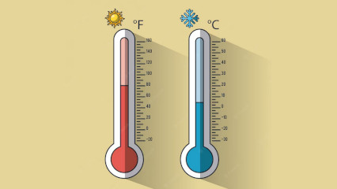

# Conversor para Fahrenheit

## Contexto

Converta uma temperatura em graus Celsius para Fahrenheit usando a fórmula `fahrenheit = 1.8 × celsius + 32`.

### Entrada

A entrada contém uma temperatura em graus Celsius.

### Saída

Imprima a temperatura em Fahrenheit com seis casas decimais.

## Exemplos

<!-- tests tests.toml --limit 3 -->
<table><tr><th><code>Entrada</code></th><th><code>Saída</code></th></tr>
<!-- INPUT --><tr><td valign="top"><pre>
43.000000
</pre></td>
<!-- OUTPUT --><td valign="top"><pre>
109.400000
</pre></td></tr>
<!-- INPUT --><tr><td valign="top"><pre>
55.000000
</pre></td>
<!-- OUTPUT --><td valign="top"><pre>
131.000000
</pre></td></tr>
<!-- INPUT --><tr><td valign="top"><pre>
99.000000
</pre></td>
<!-- OUTPUT --><td valign="top"><pre>
210.200000
</pre></td></tr>
</table>
<!-- end -->
