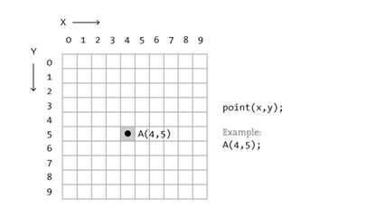

# Jogo da cobrinha


## Contexto

No jogo da cobrinha, quando a cabeça passa do limite direito, ela reaparece do lado esquerdo. Quando passa do limite inferior, reaparece na parte de cima. Imagine o jogo apenas com a cabeça da cobra. A tela é quadrada, formada por N quadrados de largura e N quadrados de altura. O quadrado de posição 0, 0 é o mais em cima na esquerda. O X cresce para direita e o Y para baixo de acordo com a seguinte figura.



A cabeça da cobra pode estar apontada para 4 possíveis direções.

```txt
U Up   (Cima)
D Down (Baixo)
L Left (Esquerda)
R Right (Direita)
```

Mavarildo se distrai por S segundos. Imagine que cada segundo, a cabeça da cobra se move 1 posição. Você deve fazer um código que calcule a posição da cabeça da cobra dada a dimensão do tabuleiro N, a posição inicial X, Y, a direção da cabeça C e a quantidade de segundos S que Mavarildo passa distraído.

### Entrada

- A entrada consiste de 5 linhas:
  - 𝑁: Um número inteiro que indica a dimensão do tabuleiro.
  - 𝑋: Um número inteiro representando a posição inicial horizontal da cabeça da cobra.
  - 𝑌: Um número inteiro representando a posição inicial vertical da cabeça da cobra.
  - 𝐶: Um caractere representando a direção da cobra ('U' para cima, 'D' para baixo, 'L' para esquerda, 'R' para direita).
  - 𝑆: Um número inteiro representando o número de segundos de distração.

### Saída

- O programa deve imprimir duas coordenadas inteiras 𝑋 e 𝑌, indicando a posição final da cabeça.

### Restrições

- 0 ≤ N ≤ 1000
- 0 ≤ X ≤ 1000
- 0 ≤ Y ≤ 1000
- 0 ≤ C ≤ 1000
- 0 ≤ S ≤ 1000

## Exemplos

<!-- tests tests.toml --limit 3 -->
<table><tr><th><code>Entrada</code></th><th><code>Saída</code></th></tr>
<!-- INPUT --><tr><td valign="top"><pre>
10
4
3
R
1
</pre></td>
<!-- OUTPUT --><td valign="top"><pre>
5 3
</pre></td></tr>
<!-- INPUT --><tr><td valign="top"><pre>
10
4
3
R
8
</pre></td>
<!-- OUTPUT --><td valign="top"><pre>
2 3
</pre></td></tr>
<!-- INPUT --><tr><td valign="top"><pre>
10
4
5
U
1
</pre></td>
<!-- OUTPUT --><td valign="top"><pre>
4 4
</pre></td></tr>
</table>
<!-- end -->
