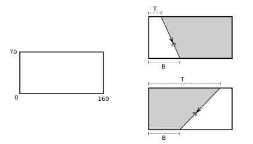

# Essa nota presta? - OBI 2019 F1P1

## Contexto

Se pegarmos uma nota de 100 reais e a cortarmos, usando uma tesoura, em dois pedaços, quanto vale cada um dos pedaços? A regra é simples: se um dos pedaços possuir estritamente mais da metade da área da nota original, então ele vale 100 reais; e o outro pedaço não vale nada.

Veja que se cada pedaço possuir exatamente metade da área original, então nenhum dos dois tem valor. Felix e Marzia decidiram fazer um corte, em linha reta, que comece no lado inferior da nota, a base, e termine no lado superior, o topo.

A nota é um retângulo de comprimento 160 centímetros e altura 70 centímetros, como mostrado na parte esquerda da figura abaixo. Felix sempre vai ficar com o pedaço mais à esquerda da nota e Marzia com o pedaço mais à direita.

A parte direita da figura ilustra dois possíveis cortes. No de cima, Marzia ficaria claramente com o maior pedaço, que vale 100 reais; e no de baixo, dá para ver que Felix é quem ficaria com o maior pedaço.

O corte reto vai começar na base a uma distância de B centímetros a partir do lado esquerdo da nota; e terminar no topo a uma distância de T centímetros também a partir do lado esquerdo da nota. Veja a indicação na parte direita da figura. Neste problema, dados os valores B e T, seu programa deve computar quem vai ficar com o pedaço que vale 100 reais, ou se o valor da nota se perdeu.

### Entrada

- A primeira linha da entrada contém um inteiro B representando a distância do ponto inicial do corte, na base, para o lado esquerdo da nota.
- A segunda linha da entrada contém um inteiro T representando a distância do ponto final do corte, no topo, para o lado esquerdo da nota.

### Saída

- Seu programa deve imprimir uma linha contendo um número inteiro:
  - 1, se Felix ficou com o pedaço que vale 100 reais;
  - 2, se Marzia ficou com o pedaço que vale 100 reais; ou
  - 0, se o valor da nota se perdeu.

## Exemplos

<!-- tests tests.toml --limit 3 -->
<table><tr><th><code>Entrada</code></th><th><code>Saída</code></th></tr>
<!-- INPUT --><tr><td valign="top"><pre>
50
86
</pre></td>
<!-- OUTPUT --><td valign="top"><pre>
2
</pre></td></tr>
<!-- INPUT --><tr><td valign="top"><pre>
70
90
</pre></td>
<!-- OUTPUT --><td valign="top"><pre>
0
</pre></td></tr>
<!-- INPUT --><tr><td valign="top"><pre>
130
138
</pre></td>
<!-- OUTPUT --><td valign="top"><pre>
1
</pre></td></tr>
</table>
<!-- end -->

## Ajuda

A área de um trapézio é calculada pela média aritmética das bases multiplicada pela altura. A fórmula para calcular a área (A) de um trapézio é:

$$A = \frac{(B + b) \cdot h}{2}$$
