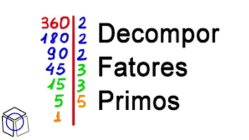

# Fatoração de um número



## Contexto

Dado um número inteiro, encontre seus fatores primos e quantas vezes cada fator aparece na fatoração. A solução deve armazenar as contagens em um mapa cuja chave é o fator primo e cujo valor é sua multiplicidade.

## Orientações

Implemente uma função com esta assinatura:

```go
func calcularFatores(numero int) map[int]int {
    fatores := make(map[int]int)
    // Calcule os fatores primos e suas multiplicidades.
    return fatores
}
```

## Entrada e saída

### Entrada

- Um número inteiro `N`.

### Saída

- Os fatores primos de `N` e a quantidade de vezes que eles aparecem na fatoração. Cada fator e sua quantidade devem ser impressos em uma linha, com o fator seguido pelo número de vezes que aparece.

## Exemplos

<!-- tests tests.toml --limit 3 -->
<table><tr><th><code>Entrada</code></th><th><code>Saída</code></th></tr>
<!-- INPUT --><tr><td valign="top"><pre>
8
</pre></td>
<!-- OUTPUT --><td valign="top"><pre>
2 3
</pre></td></tr>
<!-- INPUT --><tr><td valign="top"><pre>
40
</pre></td>
<!-- OUTPUT --><td valign="top"><pre>
2 3
5 1
</pre></td></tr>
<!-- INPUT --><tr><td valign="top"><pre>
55
</pre></td>
<!-- OUTPUT --><td valign="top"><pre>
5 1
11 1
</pre></td></tr>
</table>
<!-- end -->
