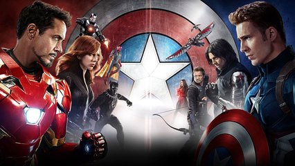

# Guerra civil no Universo Marvel

## Contexto

Na pré-estreia de Capitão América: Guerra Civil, os fãs estavam loucos e divididos entre dois times, sendo eles: Team Iron e Team Captain. Eles discutiam os motivos de seus lados saírem vencedores. Stan Lee, um estagiário de TI pensou em diversas formas de determinar o vencedor, uma delas era dizendo a força de cada personagem, depois determinar qual seria vencedor de acordo com a soma dos poderes de cada time e por fim dizer quem é o melhor de toda a batalha de acordo com o seu poder.

Crie um programa que receba o número de integrantes, crie um vetor para cada time que recebe o nome e seu respectivo poder. Some o poder de cada time e veja qual é o maior para determinar o vencedor.

* Imprima "Team Captain Wins" caso o time do Capitão vença
* "Team Iron Wins" caso seja o do Homem de Ferro, por último
* "Draw" se for empate
* E por fim, o nome do campeão com o maior poder

### Entrada

* Quantidade de integrantes do time do Homem de Ferro
* Nome e poder de cada
* Quantidade de integrantes do time do Capitão América
* Nome e poder de cada

### Saída

* Time vencedor
* Nome do campeão mais poderoso

## Exemplos
<!-- tests tests.toml --limit 3 -->
<!-- end -->
