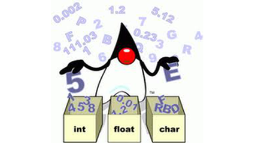

# Identificando tipos

## Contexto

Sua tarefa é criar um programa que analise uma frase e identifique o tipo de cada "palavra" ou elemento contido nela. Você deve classificar cada elemento como **str**, **int** ou **float**, seguindo um conjunto de regras específicas.

Regras de classificação:

- `str`: se o elemento contiver uma letra ou não corresponder a um dos formatos numéricos abaixo.
- `int`: um ou mais dígitos, com um sinal `-` opcional no início.
- `float`: dígitos, um ponto (`.`) e mais dígitos, com um sinal `-` opcional no início.
- Números inteiros e decimais podem ser negativos.

### Entrada

- Uma frase com palavras, números, sinais de menos, pontos e espaços.

### Saída

- Uma linha contendo o tipo de cada elemento da frase ("str", "float" ou "int"), separado por espaços.

## Restrições

- A frase terá no máximo **100** caracteres.
- Cada palavra/elemento terá no máximo **10** caracteres.

## Exemplos

<!-- tests tests.toml --limit 3 -->
<table><tr><th><code>Entrada</code></th><th><code>Saída</code></th></tr>
<!-- INPUT --><tr><td valign="top"><pre>
tenho 15 4nos 1.75 altur4 -15 conto p0rr4 -4.04
</pre></td>
<!-- OUTPUT --><td valign="top"><pre>
str int str float str int str str float
</pre></td></tr>
<!-- INPUT --><tr><td valign="top"><pre>
a proxima eleição presidencial no Brasil ocorrerá em 2 de outubro de 2018
</pre></td>
<!-- OUTPUT --><td valign="top"><pre>
str str str str str str str str int str str str int
</pre></td></tr>
<!-- INPUT --><tr><td valign="top"><pre>
aa 1 -2.0
</pre></td>
<!-- OUTPUT --><td valign="top"><pre>
str int float
</pre></td></tr>
</table>
<!-- end -->
