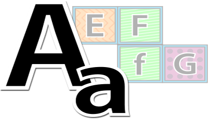

# Inverter Case de char

## Contexto

Implemente um programa que, dado um único caractere, retorne a sua versão com o "case" invertido:

- Se o caractere for minúsculo, retorne-o em maiúsculo.
- Se o caractere for maiúsculo, retorne-o em minúsculo.
- Se o caractere não for uma letra, retorne-o inalterado.

### Entrada

- Um único caractere (letra, número ou símbolo).

### Saída

- A versão invertida do caractere se for letra, ou o próprio caractere caso contrário.

## Restrições

- O caractere será qualquer um representável em **ASCII**.

## Exemplos

<!-- tests tests.toml --limit 3 -->
<table><tr><th><code>Entrada</code></th><th><code>Saída</code></th></tr>
<!-- INPUT --><tr><td valign="top"><pre>
a
</pre></td>
<!-- OUTPUT --><td valign="top"><pre>
A
</pre></td></tr>
<!-- INPUT --><tr><td valign="top"><pre>
B
</pre></td>
<!-- OUTPUT --><td valign="top"><pre>
b
</pre></td></tr>
<!-- INPUT --><tr><td valign="top"><pre>
5
</pre></td>
<!-- OUTPUT --><td valign="top"><pre>
5
</pre></td></tr>
</table>
<!-- end -->
