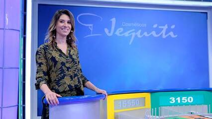

# Roda Roda Jequiti

Faça um código que simule o comportamento do jogo da forca.  
Você recebe como parâmetro a palavra real e todos as letras que já foram chutadas pelo participante e deve retornar a palavra cifrada a ser apresentada pelo programa. Nas letras não acertadas ainda, você deve colocar o caractere marcador passado por parâmetro.

Se nas palavras houver pontuação ou espaço, você deve imprimi-los corretamente. Se a letra for maiúscula, você deve imprimir maiúscula.

### Entrada

* Frase(max 100 char),
* Chutes (max 26 char)
* Caractere de marcação (1 char).

### Saída

* Uma frase com as letras chutadas corretamente e o caractere marcador nas letras erradas.

## Exemplos

<!-- tests tests.toml --limit 3 -->
<table><tr><th><code>Entrada</code></th><th><code>Saída</code></th></tr>
<!-- INPUT --><tr><td valign="top"><pre>
extraordinario
aeioubcdfgh
*
</pre></td>
<!-- OUTPUT --><td valign="top"><pre>
e***ao*di*a*io
</pre></td></tr>
<!-- INPUT --><tr><td valign="top"><pre>
Teco-Teco!
tbxyan
_
</pre></td>
<!-- OUTPUT --><td valign="top"><pre>
T___-T___!
</pre></td></tr>
<!-- INPUT --><tr><td valign="top"><pre>
Seu Pilantra!
yzxa
*
</pre></td>
<!-- OUTPUT --><td valign="top"><pre>
*** ***a***a!
</pre></td></tr>
</table>
<!-- end -->
