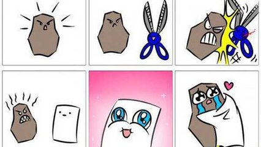

# Jokenpo das tartarugas

## Contexto

Implemente um programa que receba as jogadas de dois jogadores e determine quem ganhou a partida de "pedra, papel e tesoura", ou se houve empate. As opções de jogada são: R (pedra), P (papel), e S (tesoura). Lembrado que pedra vence tesoura, tesoura vence papel, e papel vence pedra.

### Entrada

- A entrada consiste em duas linhas, cada uma contendo um caractere representando a escolha de cada jogador:
  - O primeiro caractere representa a escolha do Jogador 1.
  - O segundo caractere representa a escolha do Jogador 2.

### Saída

- Imprima "jog1" se o primeiro jogador ganhar,
- Imprima "jog2" se o segundo jogador ganhar,
- Imprima "empate" se houver empate.

## Exemplos

<!-- tests tests.toml --limit 3 -->
<!-- end -->
