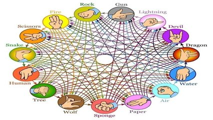

# Jokenpo com quinze opções

O jokenpo é emocionante. Normalmente, as crianças aprendem a jogar jokenpo antes de aprenderem par ou ímpar pois é mais fácil aprender que pedra quebra tesoura do que somar números e descobrir se par ou ímpar. Existem várias variações. Uma interessante com 15 níveis é a seguir. Cada elemento ganha de 7 elementos a sua frente e perder de 7 elementos que estão antes dele.

Vamos fazer do Human o número 0, Tree será 1 e assim sucessivamente. O número 3 (sponje) ganha de (4, 5, 6, 7, 8, 9, 10) e perde de (11, 12, 13, 14, 0, 1, 2).

### Entrada

- Dois números, A, B um por linha indicando as escolhas do primeiro e do segundo jogador.

### Saída

- "Empate", "Jogador 1", "Jogador 2"

## Restrições

- 0 ≤ A, B, C ≤ 14

## Exemplos

<!-- tests tests.toml --limit 3 -->
<table><tr><th><code>Entrada</code>
</th><th><code>    Saída    </code>
</th></tr><tr><td valign="top"><pre>
1
0
</pre></td><td valign="top"><pre>
Jogador 2
</pre></td></tr></table>

<table><tr><th><code>Entrada</code>
</th><th><code>    Saída    </code>
</th></tr><tr><td valign="top"><pre>
5
9
</pre></td><td valign="top"><pre>
Jogador 1
</pre></td></tr></table>

<table><tr><th><code>Entrada</code>
</th><th><code>    Saída    </code>
</th></tr><tr><td valign="top"><pre>
0
0
</pre></td><td valign="top"><pre>
Empate
</pre></td></tr></table>
<!-- end -->
