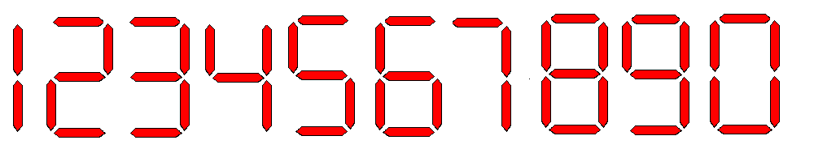

# Contando luzes

João quer montar um painel de LEDs com diversos números, mas ele não sabe quantos LEDs serão necessários para formar um número específico. Para ajudá-lo, vamos criar um programa que calcule a quantidade de LEDs necessária para exibir um número com base em uma configuração padrão de segmentos de LED.

Dado o número de casos de teste e uma sequência de números inteiros, para cada número, calcule a quantidade de LEDs necessária para montá-lo com o padrão ilustrado na imagem.

### Entrada

- Um número inteiro **N** (1 ≤ N ≤ 1000), representando o número de casos de teste.
- **N** linhas, onde cada linha contém um número inteiro **V** (1 ≤ V ≤ 10¹⁰⁰), representando o valor que João deseja montar com LEDs.

### Saída

- Para cada número **V** na entrada, exiba uma linha com a quantidade de LEDs necessária para montá-lo, seguido da palavra **"leds"**.

### Restrições

- **1 ≤ N ≤ 1000**
- **1 ≤ V ≤ 10¹⁰⁰**

## Exemplos

<!-- tests tests.toml --limit 3 -->
<!-- end -->
