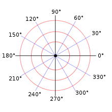

# Módulo no ângulo Cartesiano

## Contexto

- Aline: Ei André, minha vida deu uma volta de 360 graus.  
- André: Mas 360 graus volta pro mesmo lugar.  
- Aline: Eu sei, é porque eu achei na rua uma carteira sem nenhum documento e cheia de dinheiro na rua.  
- André: Então é 180 graus, tu agora tá estribada.  
- Aline: Não, é 360 mesmo, eu levei a carteira pra casa.  
- André: E?????  
- Aline: Descobri que era do meu pai.

Nosso sistema de ângulos no plano cartesiano é definido em graus. O ângulo 0 aponta para esquerda, o 90 aponta para cima, o 180 para direita e por aí vai. O 360 graus equivale voltar ao 0.  

Seu objetivo é transformar os ângulos para recolocá-los dentro do cartesiano. O ângulo 361 equivale ao 1. Ângulos negativos equivalem a andar no sentido horário. Por exemplo, -1 equivale ao 359.  

Você deve ler o ângulo e imprimir o valor correto dele dentro do cartesiano entre 0 e 359.

### Entrada

- Um número inteiro que representa o ângulo em graus.

### Saída

Imprima o ângulo equivalente entre `0` e `359` graus.

## Exemplos

<!-- tests tests.toml --limit 3 -->
<table><tr><th><code>Entrada</code></th><th><code>Saída</code></th></tr>
<!-- INPUT --><tr><td valign="top"><pre>
0
</pre></td>
<!-- OUTPUT --><td valign="top"><pre>
0
</pre></td></tr>
<!-- INPUT --><tr><td valign="top"><pre>
360
</pre></td>
<!-- OUTPUT --><td valign="top"><pre>
0
</pre></td></tr>
<!-- INPUT --><tr><td valign="top"><pre>
361
</pre></td>
<!-- OUTPUT --><td valign="top"><pre>
1
</pre></td></tr>
</table>
<!-- end -->
