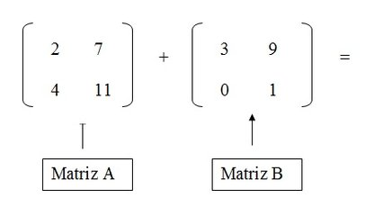

# Soma de matrizes

## Contexto

Leia duas matrizes A e B com mesmo número de linhas e colunas, e em seguida calcule e imprima a soma destas matrizes. Se S é a soma das matrizes A e B, então cada elemento S\[i\]\[j\] é calculado como A\[i\]\[j\] + B\[i\]\[j\], ou seja, a soma dos elementos de mesma posição nas matrizes A e B.

## Entrada e saída

### Entrada

- Linha 1: número de linhas das matrizes A e B.  
- Linha 2: número de colunas das matrizes A e B.  
- Linhas da matriz A.  
- Linhas da matriz B.

### Saída

- Linhas da matriz S = A + B.

## Exemplos

<!-- tests tests.toml --limit 3 -->
<!-- end -->
