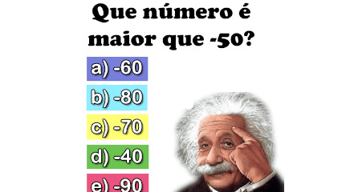

# Valor máximo entre dois números

Implemente um programa que recebe dois números inteiros e imprime o maior.

### Entrada

- Dois inteiros

### Saída

- Imprima o maior número

## Exemplos

<!-- tests tests.toml --limit 3 -->
<table><tr><th><code>Entrada</code>
</th><th><code>Saída</code>
</th></tr><tr><td valign="top"><pre>
4
9
</pre></td><td valign="top"><pre>
9
</pre></td></tr></table>

<table><tr><th><code>Entrada</code>
</th><th><code>Saída</code>
</th></tr><tr><td valign="top"><pre>
56
7
</pre></td><td valign="top"><pre>
56
</pre></td></tr></table>

<table><tr><th><code>Entrada</code>
</th><th><code>Saída</code>
</th></tr><tr><td valign="top"><pre>
46
-789
</pre></td><td valign="top"><pre>
46
</pre></td></tr></table>
<!-- end -->
