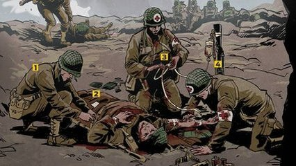

# Busca por proximidade

No quartel, os soldados formaram uma fila representada por um vetor de inteiros. Nesta fila:

- `1` representa um médico.
- `0` representa um soldado de combate.

Todo soldado de combate que está adjacente a um médico (à esquerda ou à direita) tem mais chances de sobreviver. O objetivo é calcular quantos soldados **não estão adjacentes** a um médico e, portanto, estão correndo mais riscos.

### Entrada

- linha 1:  Um número inteiro **'N'** representando a quantidade de elementos do vetor.
- linha 2: Uma sequência de **N** inteiros, onde cada elemento é **0** (soldado) ou **1** (médico).

### Saída

* A quantidade de soldados que não tem médico à sua direita ou à sua esquerda.

## Exemplos

<!-- tests tests.toml --limit 3 -->
<table><tr><th><code>Entrada</code></th><th><code>Saída</code></th></tr>
<!-- INPUT --><tr><td valign="top"><pre>
3
0 0 1
</pre></td>
<!-- OUTPUT --><td valign="top"><pre>
1
</pre></td></tr>
<!-- INPUT --><tr><td valign="top"><pre>
7
1 0 0 0 1 0 1
</pre></td>
<!-- OUTPUT --><td valign="top"><pre>
1
</pre></td></tr>
<!-- INPUT --><tr><td valign="top"><pre>
5
0 0 1 0 0
</pre></td>
<!-- OUTPUT --><td valign="top"><pre>
2
</pre></td></tr>
</table>
<!-- end -->
