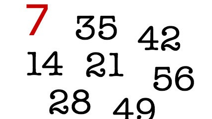

# Múltiplo de sete

Implemente um programa que recebe um número inteiro e imprime "SIM" caso ele seja múltiplo de 7, e "NAO" caso contrário.

### Entrada

- Um número inteiro.

### Saída

- "SIM" caso o número seja múltiplo de 7.
- "NAO" caso o número não seja múltiplo de 7.

## Exemplos

<!-- tests tests.toml --limit 3 -->
<!-- end -->
