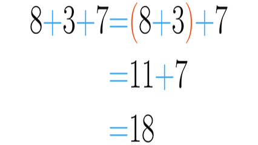

# Encontrando e somando

Dada uma frase(max 100 char) com palavras(letras minusculas), números e espaço, some todos os números que encontrar. Numa palavra existem apenas números ou apenas alfabéticos. Palavras são separadas por 1 espaço.

### Entrada

* Uma frase(max 100 char) com palavras (letras minusculas), números e espaço.

### Saida

* o somatório dos numeros.

## Exemplos

<!-- tests tests.toml --limit 3 -->
<table><tr><th><code>Entrada</code></th><th><code>Saída</code></th></tr>
<!-- INPUT --><tr><td valign="top"><pre>
apesar de 2 jogadores serem expulsos, a seleção brasileira venceu a seleção italiana por 5 x 1
</pre></td>
<!-- OUTPUT --><td valign="top"><pre>
8
</pre></td></tr>
<!-- INPUT --><tr><td valign="top"><pre>
meus 3 cachorros comeram 2 ratos em 11 horas
</pre></td>
<!-- OUTPUT --><td valign="top"><pre>
16
</pre></td></tr>
<!-- INPUT --><tr><td valign="top"><pre>
os 2 irmãos de maria dormiram os ultimos 2 dias na casa de seus avós
</pre></td>
<!-- OUTPUT --><td valign="top"><pre>
4
</pre></td></tr>
</table>
<!-- end -->
