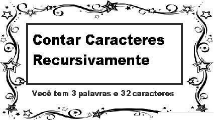

# Contagem de ocorrências



Forneça um algoritmo recursivo para contar quantas vezes um determinado caractere ocorre em uma string. Não é permitido usar comandos de repetição nesta função. A função main e o protótipo da função recursiva são fornecidos no arquivo de envio logo abaixo.

``` C
#include <stdio.h>
#include <string.h>

// Retorna o números de ocorrências do caractere 'c' na string 's' (com 'n' caracteres).
// Algoritmo deve ser recursivo e sem comandos de repetição.
int conta_char_rec(char s[], int n, char c){

}

int main(){
   char s[102], c;
   fgets(s, sizeof(s), stdin);
   scanf("%c", &c);
   int n = strlen(s) - 1;
   printf("%d", conta_char_rec(s,n,c));
}
```

### Entrada

- Linha 1: string com até 100 caracteres.
- Linha 2: caractere (que será contado na string anterior)

### Saída

- Número de ocorrências do caractere na string.

## Exemplos

<!-- tests tests.toml --limit 3 -->
<table><tr><th><code>Entrada</code></th><th><code>Saída</code></th></tr>
<!-- INPUT --><tr><td valign="top"><pre>
fundamentos de programacao
a
</pre></td>
<!-- OUTPUT --><td valign="top"><pre>
4
</pre></td></tr>
<!-- INPUT --><tr><td valign="top"><pre>
o rato roeu a roupa do rei de roma
a
</pre></td>
<!-- OUTPUT --><td valign="top"><pre>
4
</pre></td></tr>
<!-- INPUT --><tr><td valign="top"><pre>
o rato roeu a roupa do rei de roma
x
</pre></td>
<!-- OUTPUT --><td valign="top"><pre>
0
</pre></td></tr>
</table>
<!-- end -->
