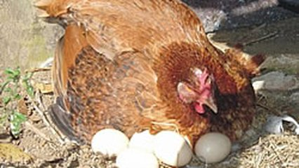

# Escolhendo o maior

Leia 4 números e imprima o maior valor.

### Entrada

* Leia quatro valores inteiros do usuário.

### Saída

* Imprima o maior valor lido.

## Exemplos

<!-- tests tests.toml --limit 3 -->
<!-- end -->
