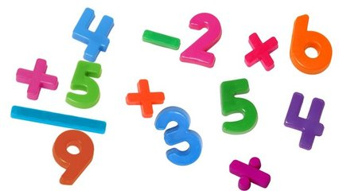

# Operações básicas

## Contexto

Leia dois números inteiros e calcule a soma, a subtração, a multiplicação, a divisão real e o resto da divisão, nessa ordem.

### Entrada

A entrada contém dois números inteiros, um por linha.

### Saída

Imprima um resultado por linha, na ordem descrita. A divisão real deve ter duas casas decimais.

### Restrições

- O segundo número é diferente de zero.

## Exemplos

<!-- tests tests.toml --limit 3 -->
<table><tr><th><code>Entrada</code></th><th><code>Saída</code></th></tr>
<!-- INPUT --><tr><td valign="top"><pre>
1
4
</pre></td>
<!-- OUTPUT --><td valign="top"><pre>
5
-3
4
0.25
1
</pre></td></tr>
<!-- INPUT --><tr><td valign="top"><pre>
3
3
</pre></td>
<!-- OUTPUT --><td valign="top"><pre>
6
0
9
1.00
0
</pre></td></tr>
<!-- INPUT --><tr><td valign="top"><pre>
2
4
</pre></td>
<!-- OUTPUT --><td valign="top"><pre>
6
-2
8
0.50
2
</pre></td></tr>
</table>
<!-- end -->
