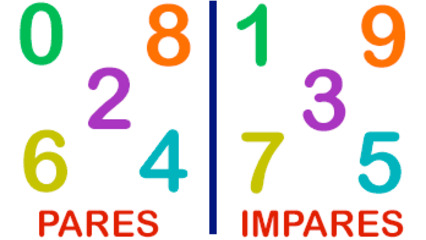

# Par ou impar

Implemente um programa que recebe um número inteiro e diga se ele é par ou impar.

### Entrada

- Um inteiro

### Saída

- "PAR" se o número for impar
- "IMPAR" se o número for par

## Exemplos

<!-- tests tests.toml --limit 3 -->
<table><tr><th><code>Entrada</code>
</th><th><code>  Saída  </code>
</th></tr><tr><td valign="top"><pre>
3
</pre></td><td valign="top"><pre>
IMPAR
</pre></td></tr></table>

<table><tr><th><code>Entrada</code>
</th><th><code>  Saída  </code>
</th></tr><tr><td valign="top"><pre>
12
</pre></td><td valign="top"><pre>
PAR
</pre></td></tr></table>

<table><tr><th><code>Entrada</code>
</th><th><code>  Saída  </code>
</th></tr><tr><td valign="top"><pre>
33
</pre></td><td valign="top"><pre>
IMPAR
</pre></td></tr></table>
<!-- end -->
