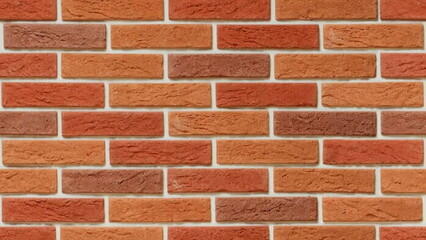

# Paredes sobrepondo a visão

Um engenheiro chamado Aluízio constrói algumas paredes de várias alturas em linha. Agora, ele quer contar o número total de paredes construídas e relatar esse número ao seu chefe. Mas o relatório que Bob fez estava errado porque ele contou o número total de paredes que ele era capaz de ver estando ao lado esquerdo da primeira parede. Então ele só foi capaz de ver algumas paredes e não todas porque algumas paredes ficavam ocultadas. Você pode prever o número de paredes contadas por Aluízio.

Aluízio só pode ver paredes quando estão atrás se elas são maiores que as que estão na frente.

### Entrada

A primeira linha de cada caso de teste contém N denotando o número real de paredes.

A segunda linha de cada caso de teste contém N inteiros (A1 ... An) denotando a altura de cada parede.

### Saída

Imprima um único inteiro denotando o número total de paredes contadas por Bob

## Exemplos

<!-- tests tests.toml --limit 3 -->
<table><tr><th><code>   Entrada   </code>
</th><th><code>Saída</code>
</th></tr><tr><td valign="top"><pre>
5
1 3 3 5 4
</pre></td><td valign="top"><pre>
3
</pre></td></tr></table>

<table><tr><th><code>   Entrada   </code>
</th><th><code>Saída</code>
</th></tr><tr><td valign="top"><pre>
4
1 2 3 5 
</pre></td><td valign="top"><pre>
4
</pre></td></tr></table>

<table><tr><th><code>   Entrada   </code>
</th><th><code>Saída</code>
</th></tr><tr><td valign="top"><pre>
4
5 5 2 1
</pre></td><td valign="top"><pre>
1
</pre></td></tr></table>
<!-- end -->
