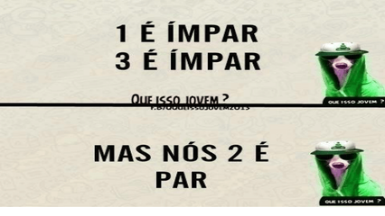

# Calculando soma

Dado dois números inteiros **A** e **B**, some todos os números inteiros pares que estão entre **A** e **B**, inclusive **A** e **B**.

### Entrada

- Dois números inteiros **A** e **B**, sendo **B** maior ou igual a **A**.

### Saída

- A soma de todos os números pares entre **A** e **B**, inclusive **A** e **B**.
- Se **A** for maior que **B**, imprima **"invalido"**.

## Exemplos

<!-- tests tests.toml --limit 3 -->
<table><tr><th><code>Entrada</code>
</th><th><code>   Saída   </code>
</th></tr><tr><td valign="top"><pre>
1
10
</pre></td><td valign="top"><pre>
30
</pre></td></tr></table>

<table><tr><th><code>Entrada</code>
</th><th><code>   Saída   </code>
</th></tr><tr><td valign="top"><pre>
1
5
</pre></td><td valign="top"><pre>
6
</pre></td></tr></table>

<table><tr><th><code>Entrada</code>
</th><th><code>   Saída   </code>
</th></tr><tr><td valign="top"><pre>
5
1
</pre></td><td valign="top"><pre>
invalido
</pre></td></tr></table>
<!-- end -->
