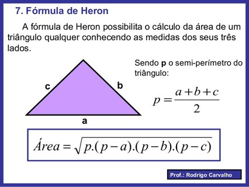

# Pintando a casa

## Contexto

Fernando quer calcular a área de uma parede triangular para estimar a quantidade de tinta. Calcule a área do triângulo a partir dos comprimentos dos três lados, usando a Fórmula de Heron.

### Entrada

A entrada contém os comprimentos dos três lados do triângulo, um número por linha.

### Saída

Imprima a área do triângulo com duas casas decimais.

## Exemplos

<!-- tests tests.toml --limit 3 -->
<table><tr><th><code>Entrada</code></th><th><code>Saída</code></th></tr>
<!-- INPUT --><tr><td valign="top"><pre>
4
3
5
</pre></td>
<!-- OUTPUT --><td valign="top"><pre>
6.00
</pre></td></tr>
<!-- INPUT --><tr><td valign="top"><pre>
10
12
16
</pre></td>
<!-- OUTPUT --><td valign="top"><pre>
59.92
</pre></td></tr>
<!-- INPUT --><tr><td valign="top"><pre>
12
15
13
</pre></td>
<!-- OUTPUT --><td valign="top"><pre>
74.83
</pre></td></tr>
</table>
<!-- end -->
