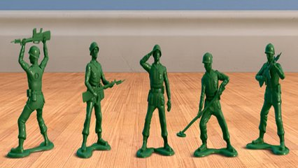

# Soldados e tamanhos



Major General Brigadeiro quer separar os pequenos soldados dos grandes soldados.

Depois de muito discutir com o Cabo Tigre Banguela qual o conceito de pequeno e grande eles chegaram em uma conclusão favorável. Primeiro precisam calcular a média de altura dos soldados. Então, pequenos são todos os que forem menores que a média e grandes são todos os que forem maiores que a média.


Leia um vetor de inteiros, calcule a média e imprima para cada valor do vetor se ele é menor(P), igual(M) ou maior(G) que a média.  
  
Sugestão: Faça um função que calcula a média:  

```c
double media(int vet[], int qtd){  
    //seu código aqui
}  
```

### Entrada

* Quantidade de soldados.
* Altura em double de cada soldado.  

### Saída

* Média das altura com duas casas decimais.
* Para cada soldado, imprima 'P' se o mesmo tiver altura menor que a média, 'M' se for exatamente igual à média e 'G' se for maior que a média.  

## Exemplos

<!-- tests tests.toml --limit 3 -->
<table><tr><th><code>Entrada</code></th><th><code>Saída</code></th></tr>
<!-- INPUT --><tr><td valign="top"><pre>
1
1.30
</pre></td>
<!-- OUTPUT --><td valign="top"><pre>
1.30
M
</pre></td></tr>
<!-- INPUT --><tr><td valign="top"><pre>
2
1.70 1.60
</pre></td>
<!-- OUTPUT --><td valign="top"><pre>
1.65
G P
</pre></td></tr>
<!-- INPUT --><tr><td valign="top"><pre>
3
1.70 1.60 1.8
</pre></td>
<!-- OUTPUT --><td valign="top"><pre>
1.70
M P G
</pre></td></tr>
</table>
<!-- end -->
