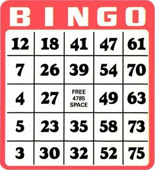

# Gerador de cartelas do Bingo 75



## Objetivo

Gere uma cartela aleatória para a modalidade de bingo de `75` bolas.

## Regras

- A cartela tem `5` linhas e `5` colunas, identificadas por `B`, `I`, `N`, `G` e `O`.
- Cada coluna contém números distintos dentro de sua faixa:
  - `B`: cinco números de `1` a `15`.
  - `I`: cinco números de `16` a `30`.
  - `N`: quatro números de `31` a `45`.
  - `G`: cinco números de `46` a `60`.
  - `O`: cinco números de `61` a `75`.
- A casa central da coluna `N` é livre e deve ser exibida como `##`.
- Cada execução gera uma cartela.

Para uma referência da modalidade e das faixas das colunas, consulte o [Regulamento do Bingo 75](https://boe.incv.cv/Bulletins/Download/2282).

## Interação

Na pasta da tarefa, execute `tko run . -l go`. O programa gera e exibe uma cartela, sem pedir entrada.

## Exemplos de execução

Os exemplos abaixo mostram cartelas de execuções distintas.


```text
Cartela gerada:
B  I  N  G  O
12 18 31 58 63
 3 19 43 54 67
 1 26 ## 59 71
10 23 45 50 68
14 21 38 60 65

Cartela gerada:
B  I  N  G  O
 4 17 43 50 67
12 28 41 53 68
 9 20 ## 59 72
11 19 39 60 70
13 16 37 48 62
```

## Etapas

1. Defina as faixas de números para as cinco colunas.
2. Sorteie números sem repetição dentro de cada coluna.
3. Deixe vazia a posição central da coluna `N` e mostre-a como `##`.
4. Exiba o cabeçalho e as cinco linhas da cartela.

## Critérios de conclusão

- A cartela contém cinco linhas e cinco colunas com cabeçalho `BINGO`.
- Cada número está na faixa da coluna correspondente e não se repete nela.
- A posição central da coluna `N` contém `##`, e essa coluna tem somente quatro números.
- Cada execução gera uma cartela completa.
