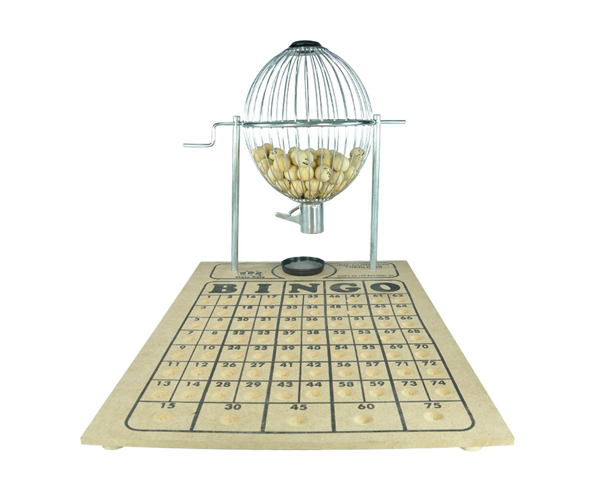

# Roleta e rack do Bingo 75



## Objetivo

Simule o sorteio das `75` bolas do bingo. Cada bola retirada sai da roleta e aparece no rack das bolas sorteadas.

## Regras

- A roleta começa com os números de `1` a `75`.
- A cada sorteio, escolha uma bola aleatória entre as que ainda estão na roleta. Uma bola sorteada não volta à roleta.
- Mostre a roleta e o rack em ordem crescente. Use `__` para indicar uma bola retirada da roleta ou ainda ausente do rack.
- Digite `1` para sortear outra bola e `0` para encerrar. Uma opção inválida não altera o sorteio.
- Se todas as bolas forem sorteadas, encerre a simulação.

Para uma referência sobre a modalidade, consulte o [Regulamento do Bingo 75](https://boe.incv.cv/Bulletins/Download/2282).

## Interação

Na pasta da tarefa, execute `tko run . -l go`. O programa exibe a roleta inicial e, após cada sorteio, mostra a bola retirada, a roleta atualizada e o rack.

## Exemplos de execução

```text
Iniciando Bingo:

Roleta:
 1  2  3  4  5  6  7  8  9 10 11 12 13 14 15
16 17 18 19 20 21 22 23 24 25 26 27 28 29 30
31 32 33 34 35 36 37 38 39 40 41 42 43 44 45
46 47 48 49 50 51 52 53 54 55 56 57 58 59 60
61 62 63 64 65 66 67 68 69 70 71 72 73 74 75
Escolha 1 para pedir bola e 0 para sair
>> 1

Numero sorteado 57

Roleta:
 1  2  3  4  5  6  7  8  9 10 11 12 13 14 15
16 17 18 19 20 21 22 23 24 25 26 27 28 29 30
31 32 33 34 35 36 37 38 39 40 41 42 43 44 45
46 47 48 49 50 51 52 53 54 55 56 __ 58 59 60
61 62 63 64 65 66 67 68 69 70 71 72 73 74 75

Rack:
__ __ __ __ __ __ __ __ __ __ __ __ __ __ __
__ __ __ __ __ __ __ __ __ __ __ __ __ __ __
__ __ __ __ __ __ __ __ __ __ __ __ __ __ __
__ __ __ __ __ __ __ __ __ __ __ 57 __ __ __
__ __ __ __ __ __ __ __ __ __ __ __ __ __ __
Escolha 1 para pedir bola e 0 para sair
>> 0
Obrigado e volte sempre.
```

## Etapas

1. Crie o conjunto inicial de bolas de `1` a `75`.
2. Mostre as bolas disponíveis e as bolas sorteadas.
3. Ao receber `1`, escolha e retire uma bola da roleta, atualize o rack e mostre o estado.
4. Ao receber `0` ou depois do sorteio da última bola, encerre a simulação.

## Critérios de conclusão

- Nenhuma bola é sorteada mais de uma vez.
- Cada bola sorteada desaparece da roleta e aparece no rack.
- As duas listas são exibidas em ordem crescente e com `__` nas posições correspondentes.
- A simulação aceita `0` para encerrar e termina quando todas as bolas forem sorteadas.
