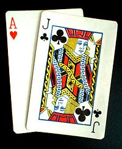

# Blackjack 21



## Objetivo

Implemente uma versão simplificada de Blackjack 21 em que uma pessoa joga contra a mesa (computador). A atividade progride de uma rodada simples para apostas, várias rodadas e validação das entradas.

Para conhecer melhor o jogo original, consulte [Blackjack na Wikipédia](https://pt.wikipedia.org/wiki/Blackjack).

## Regras

- Cartas de `2` a `10` valem seus próprios valores.
- Valete (`J`), Dama (`Q`) e Rei (`K`) valem `10` pontos.
- Ás (`A`) pode valer `1` ou `11`, conforme for mais vantajoso. Enquanto a soma passar de `21` e houver um Ás valendo `11`, reduza esse Ás para `1`.
- Cada rodada começa com um novo baralho padrão de `52` cartas embaralhado. As cartas não voltam ao baralho durante a rodada.
- O jogador começa com `2` cartas. A mesa começa com `2` cartas: uma visível e uma fechada.
- Se uma das mãos iniciais somar `21`, a rodada termina imediatamente. Se somente o jogador somar `21`, ele vence; se a mesa somar `21`, ela vence, inclusive em caso de empate.
- O jogador pode pedir uma carta (`1`) ou parar (`2`). Se a soma passar de `21`, perde a rodada.
- Quando o jogador para, a mesa revela a carta fechada e compra cartas até empatar ou superar a pontuação do jogador, ou estourar `21`.
- Em caso de empate de pontos, a mesa vence.
- Nas interações de exemplo, `>>` marca o ponto em que o programa espera uma entrada.

## Interação

A atividade é dividida em três etapas. A primeira implementa uma rodada. A segunda adiciona apostas e permite jogar várias rodadas. A terceira valida as entradas do jogador.

Na pasta da tarefa, execute `tko run . -l go` para iniciar e validar a interação.

## Exemplos de execução

### Etapa 1 – Primeira versão

Implemente uma única rodada entre jogador e mesa, com as seguintes interações:

Na exibição inicial, a mesa mostra apenas sua carta visível; a segunda carta fica escondida até a vez da mesa.

```text
Iniciando Rodada:
# Mesa recebe  7 - Total  7 [ 7 ]
# Voce recebe  A - Total 11 [ A ]
# Voce recebe  2 - Total 13 [ A 2 ]
Pedir = 1, Parar = 2 
>> 1
# Voce recebe  3 - Total 16 [ A 2 3 ]
Pedir = 1, Parar = 2 
>> 2
# Mesa joga, calcula e exibe o resultado final
```

### Etapa 2 – Apostas e múltiplas rodadas

Adicione apostas entre `5` e `100`, limitadas também ao saldo disponível, e saldo inicial de `100` unidades. Desconte a aposta antes da rodada. Em caso de vitória, credite `2×` a aposta (a devolução da aposta e um prêmio igual). Ao perder, não devolva a aposta. Encerre a partida automaticamente se o saldo ficar abaixo de `5`. O jogador também pode sair digitando `-1` ao informar uma aposta.

```text
Rodada 1:
Dinheiro: 100
Digite valor da aposta ou -1 para sair: 25
...
Rodada 2:
Dinheiro: 75
Digite valor da aposta ou -1 para sair: 50
...
```

O valor apostado é descontado antes de começar. Por exemplo, uma vitória após apostar `25` credita `50` ao saldo, incluindo a devolução da aposta.

### Etapa 3 – Validação de entradas

Valide as entradas em todos os momentos: as apostas devem ser numéricas e respeitar os limites, e as ações devem ser `1` ou `2`. Trate textos e valores fora do intervalo.

```text
Digite valor da aposta ou -1 para sair: vinte
Valor inválido.
Digite valor da aposta ou -1 para sair: 300
Valor inválido.
...
Pedir = 1, Parar = 2
>> batatas
Valor inválido.
```

## Etapas

1. Implemente uma rodada sem apostas: distribuir as cartas iniciais, aceitar pedidos ou parada, e decidir o resultado.
2. Adicione saldo, apostas e repetição de rodadas.
3. Valide cada entrada e mantenha o jogo em estado válido após uma entrada incorreta.
4. Execute e verifique manualmente cada etapa no terminal.

### Desafio opcional

- Adicione múltiplos jogadores, com turnos alternados.
- Implemente regras extras, como dobrar a aposta ou dividir cartas (`split`).

## Critérios de conclusão

- Os valores das cartas e o tratamento dos ases seguem as regras descritas.
- O jogador pode pedir cartas ou parar, e a rodada é encerrada com o resultado correto.
- A etapa de apostas controla o saldo e permite encerrar com `-1`.
- Entradas inválidas são rejeitadas sem avançar ou alterar indevidamente o estado do jogo.
