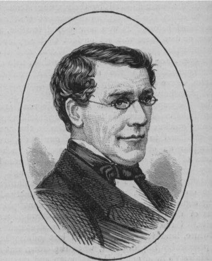
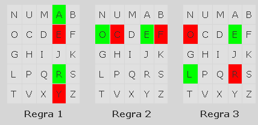

# A cifra de Playfair



## Objetivo

Implemente um programa que cifre ou decifre o conteúdo de um arquivo usando a cifra de Playfair. O programa recebe o modo e o nome do arquivo como argumentos, solicita a chave e mostra o resultado.

## Regras

- A grade tem `5 × 5` posições e usa o alfabeto de `A` a `Z`, sem a letra `W`.
- Para montar a grade, coloque primeiro as letras únicas da chave, em maiúsculas e na ordem em que aparecem, ignorando espaços e `W`. Complete as posições restantes com as letras do alfabeto em ordem, também sem `W`.
- O texto é convertido para maiúsculas; espaços, tabulações e quebras de linha são ignorados. As letras são processadas em pares.
- Se um par tiver letras iguais, insira `X` entre elas. Se a letra repetida for `X`, insira `Z`. Se sobrar uma letra no final, acrescente `X`, ou `Z` quando a letra for `X`.
- Como a grade não contém `W`, ignore essa letra na chave. O texto de entrada não pode conter `W`; informe o problema e encerre sem gerar o resultado.
- Na cifragem, aplique a regra correspondente a cada par:
  - Mesma linha: substitua cada letra pela seguinte à direita, voltando ao início da linha quando necessário.
  - Mesma coluna: substitua cada letra pela seguinte abaixo, voltando ao início da coluna quando necessário.
  - Linhas e colunas diferentes: mantenha a linha de cada letra e troque suas colunas.
- Na decifragem, aplique as operações inversas. O resultado mantém os `X` ou `Z` usados no preenchimento; removê-los não faz parte desta atividade.
- Separe os pares exibidos por um espaço. Grave a saída da cifragem em `cifra.txt` e a da decifragem em `texto.txt`, na pasta de execução.



Os exemplos abaixo usam a chave `POWER RANGER`, da qual são retiradas as letras repetidas e `W`, resultando em `POERANG` e na grade:

```text
P O E R A
N G B C D
F H I J K
L M Q S T
U V X Y Z
```

## Interação

Na pasta da atividade, execute `tko run . -l go` para validar a solução. Para usar o programa, informe o modo `cifrar` ou `decifrar` e o arquivo de entrada. Em seguida, digite a chave quando solicitada.

```text
go run src/go/main.go cifrar texto.txt
Digite a chave:
POWER RANGER
O texto cifrado eh:
VG EY AE TO QY TR OA PB GA BY
```

O arquivo `texto.txt` contém `MORRO MAS SAPRENDO C`. A saída também é gravada em `cifra.txt`.

Para decifrar, informe o arquivo cifrado e a mesma chave:

```text
go run src/go/main.go decifrar cifra.txt
Digite a chave:
POWER RANGER
O texto decifrado eh:
MO RX RO MA SX SA PR EN DO CX
```

## Etapas

1. Leia o modo e o nome do arquivo; leia a chave como uma linha completa.
2. Monte a grade eliminando repetições da chave e a letra `W`.
3. Prepare o texto em pares, separando letras iguais e completando o último par quando necessário.
4. Localize cada letra na grade e aplique a regra de cifragem ou sua inversa.
5. Mostre e grave os pares resultantes.

## Critérios de conclusão

- A grade tem 25 letras distintas, contém todas as letras de `A` a `Z` exceto `W` e começa pelas letras únicas da chave.
- Pares na mesma linha, coluna ou em linhas e colunas diferentes seguem a regra correspondente.
- A preparação separa letras iguais e completa um par incompleto, usando `Z` como separador quando necessário para evitar um par `XX`.
- Decifrar um texto cifrado retorna o texto preparado para cifragem, incluindo as letras de preenchimento.
- O programa aceita os modos `cifrar` e `decifrar`, mostra o resultado e grava o arquivo de saída correspondente.
