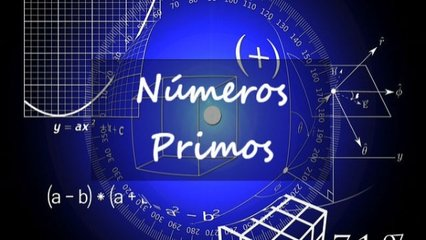

# Calculando se é

## Contexto

Dado um número inteiro `N`, determine recursivamente se ele é primo.

### Entrada

- Um número inteiro `N`.

### Saída

- Imprima `1` se `N` for primo e `0` caso contrário.

## Exemplos

<!-- tests tests.toml --limit 3 -->
<!-- end -->

## Orientações

Crie uma função recursiva que teste se `N` tem divisores. Encerre a busca quando encontrar um divisor ou quando já tiver testado até a raiz quadrada de `N`.
