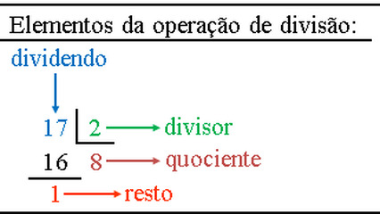

# Tipos de divisão

## Contexto

Dados dois números inteiros, calcule o quociente inteiro, o resto da divisão e o quociente real.

### Entrada

A entrada contém dois números inteiros, um por linha.

### Saída

Imprima, em linhas separadas, o quociente inteiro, o resto e o quociente real com duas casas decimais.

### Restrições

- O segundo número é diferente de zero.

## Exemplos

<!-- tests tests.toml --limit 3 -->
<table><tr><th><code>Entrada</code></th><th><code>Saída</code></th></tr>
<!-- INPUT --><tr><td valign="top"><pre>
6
3
</pre></td>
<!-- OUTPUT --><td valign="top"><pre>
2
0
2.00
</pre></td></tr>
<!-- INPUT --><tr><td valign="top"><pre>
7
3
</pre></td>
<!-- OUTPUT --><td valign="top"><pre>
2
1
2.33
</pre></td></tr>
<!-- INPUT --><tr><td valign="top"><pre>
5
2
</pre></td>
<!-- OUTPUT --><td valign="top"><pre>
2
1
2.50
</pre></td></tr>
</table>
<!-- end -->
