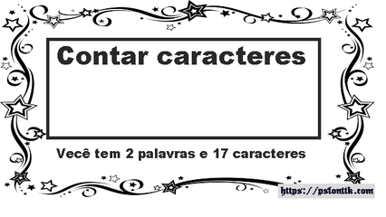

# Contando caracteres recursivamente

Forneça um algoritmo recursivo para contar quantas vezes um determinado caractere ocorre em uma string. Não é permitido usar comandos de repetição nesta função. A função main e o protótipo da função recursiva são fornecidos no arquivo de envio.

### Entrada

- Linha 1: string com até 100 caracteres.
- Linha 2: caractere (que será contado na string anterior)

### Saída

- Número de ocorrências do caractere na string.

## Exemplos

<!-- tests tests.toml --limit 3 -->
<table><tr><th><code>Entrada</code></th><th><code>Saída</code></th></tr>
<!-- INPUT --><tr><td valign="top"><pre>
fundamentos de programacao
a
</pre></td>
<!-- OUTPUT --><td valign="top"><pre>
4
</pre></td></tr>
</table>
<!-- end -->
