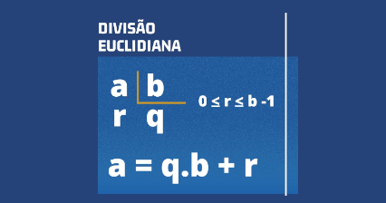

# Resultado e resto na divisão

Implemente um programa que receba dois inteiros positivos e calcule o valor do quociente e resto da divisão do primeiro pelo segundo número.

### Entrada

- Dois inteiros, um por linha

### Saída

- Quociente e resto separados por espaço

## Exemplos

<!-- tests tests.toml --limit 3 -->
<!-- end -->
