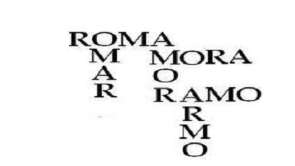

# Rocicleia o Locioreca - Anagramas

## Contexto

Sabia que o seu nome e o meu são um anagrama? Disse Rocicleia para Locioreca.
Licioroca não sabia português, mas sabia programar. Ajude Locioroca a fazer um  código que informa se duas palavras são anagramas.

Uma palavra é anagrama de outra se é formada pelas mesmas letras nas mesmas QUANTIDADES, mas em qualquer ordem.

Dadas duas palavras, imprima sim se elas são anagramas e não se não são anagramas.

### Entrada

* A entrada são duas palavras, uma por linha, apenas caracteres minúsculos e sem espaços.

### Saída

* A saída deve ser apenas "sim" ou "nao".

## Exemplos
<!-- tests tests.toml --limit 3 -->
<table><tr><th><code>Entrada</code></th><th><code>Saída</code></th></tr>
<!-- INPUT --><tr><td valign="top"><pre>
paralelepipedo
pepidoelelapar
</pre></td>
<!-- OUTPUT --><td valign="top"><pre>
sim
</pre></td></tr>
<!-- INPUT --><tr><td valign="top"><pre>
rocicleia
licioreca
</pre></td>
<!-- OUTPUT --><td valign="top"><pre>
sim
</pre></td></tr>
<!-- INPUT --><tr><td valign="top"><pre>
batata
tabata
</pre></td>
<!-- OUTPUT --><td valign="top"><pre>
sim
</pre></td></tr>
</table>
<!-- end -->
