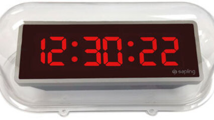

# Converter segundos em h:m:s

Implemente um programa que recebe um tempo em segundos e transformar no formato:

Hora:Minuto:Segundo

- A hora pode ser obtida pela divisão inteira do tempo por 3600.
- Agora pegue o resto de tempo por 3600, isso é o que sobrou pra minutos e segundos.
- A quantidade de minutos é obtida pela divisão inteira do resto por 60.
- O resto da divisão por 60 é a quantidade de segundos.

### Entrada

- Um único número inteiro representando o tempo em segundos.

### Saída

- Tempo formatado em Horas:Minutos:Segundos

## Exemplos

<!-- tests tests.toml --limit 3 -->
<table><tr><th><code>Entrada</code></th><th><code>Saída</code></th></tr>
<!-- INPUT --><tr><td valign="top"><pre>
3641
</pre></td>
<!-- OUTPUT --><td valign="top"><pre>
1:0:41
</pre></td></tr>
<!-- INPUT --><tr><td valign="top"><pre>
22067
</pre></td>
<!-- OUTPUT --><td valign="top"><pre>
6:7:47
</pre></td></tr>
<!-- INPUT --><tr><td valign="top"><pre>
9934
</pre></td>
<!-- OUTPUT --><td valign="top"><pre>
2:45:34
</pre></td></tr>
</table>
<!-- end -->
