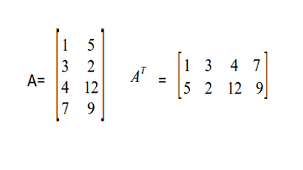

# Matrizes simétricas

## Contexto

Uma matriz diz-se simétrica se coincidir com a sua transposta, ou seja, se A = AT. Faça uma função que verifique se uma matriz 3x3 é simétrica ou não. Tenha como saida a informação "nao" se não for simétrica e "sim" caso contrário.

## Entrada e saída

### Entrada

- Três linhas, cada uma com três números inteiros separados por espaços.

### Saída

- `sim` se a matriz for simétrica; `nao` caso contrário.

## Restrições

- A matriz terá sempre tamanho 3×3.

## Exemplos

<!-- tests tests.toml --limit 3 -->
<table><tr><th><code>Entrada</code></th><th><code>Saída</code></th></tr>
<!-- INPUT --><tr><td valign="top"><pre>
1 4 7
4 1 8
7 8 1
</pre></td>
<!-- OUTPUT --><td valign="top"><pre>
sim
</pre></td></tr>
<!-- INPUT --><tr><td valign="top"><pre>
3 3 3
3 3 3
3 3 3
</pre></td>
<!-- OUTPUT --><td valign="top"><pre>
sim
</pre></td></tr>
<!-- INPUT --><tr><td valign="top"><pre>
1 2 3
4 5 6
7 8 9
</pre></td>
<!-- OUTPUT --><td valign="top"><pre>
nao
</pre></td></tr>
</table>
<!-- end -->
