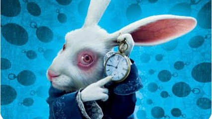
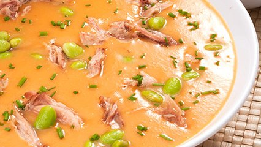

# Sopa de coelho



## Contexto

Zé da Carroça comprou um casal de coelhos. Ele gosta muito de sopa de coelho, mas também sonha em vender carne de coelho por todo o sertão central. Por isso, está decidindo se prepara a sopa agora ou espera que os coelhos se reproduzam.

A quantidade de casais segue estas regras:

- No primeiro mês nasce um casal.
- Cada casal pode se reproduzir a partir do segundo mês de vida.
- Não há problemas genéticos no cruzamento consanguíneo.
- A partir daí, cada casal dá à luz a um novo casal por mês.

Essas regras geram a sequência `1, 1, 2, 3, 5, 8, 13, ...`, conhecida como sequência de Fibonacci. Dado `N`, imprima o `N`-ésimo termo. Você pode consultar [mais informações sobre a sequência de Fibonacci](https://brasilescola.uol.com.br/matematica/sequencia-fibonacci.htm).



### Entrada

- Um número inteiro `N`.

### Saída

- O `N`-ésimo termo da sequência de Fibonacci.

### Restrições

- `0 ≤ N ≤ 50`

## Exemplos

<!-- tests tests.toml --limit 3 -->
<table><tr><th><code>Entrada</code></th><th><code>Saída</code></th></tr>
<!-- INPUT --><tr><td valign="top"><pre>
1
</pre></td>
<!-- OUTPUT --><td valign="top"><pre>
1
</pre></td></tr>
<!-- INPUT --><tr><td valign="top"><pre>
6
</pre></td>
<!-- OUTPUT --><td valign="top"><pre>
8
</pre></td></tr>
<!-- INPUT --><tr><td valign="top"><pre>
50
</pre></td>
<!-- OUTPUT --><td valign="top"><pre>
12586269025
</pre></td></tr>
</table>
<!-- end -->

## Orientações

Implemente a recorrência `fib(n) = fib(n-1) + fib(n-2)` e guarde no mapa os termos já calculados para evitar repetições. Uma assinatura Go possível é:

```go
func fib(n int, cache map[int]int64) int64
```
