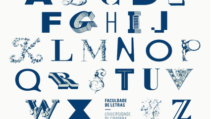

# Sorvete suor casaca chicletes - Letras em Comum

- Sabe o que as palavras a seguir tem em comum?
  - sorvete suor casaca chicletes pegasus
- Todas tem a letra s!
- E essas daqui? 
  - minhoca quixe tempero musica roubo
- Não existe nenhuma letra que se repita em todas!  
  - E essas daqui?  
  - acaro cocegas cagado aquecido
  - Elas tem em comum as letras (a, c e o).

Dada uma frase com até 100 caracteres, será que você consegue me dizer a quantidade de letras que todas as palavras tem em comum?

### Entrada

- Uma frase com até 100 caracteres.  

### Saída

- Um inteiro representando a quantidade de letras em comum.

## Exemplos

<!-- tests tests.toml --limit 3 -->
<table><tr><th><code>Entrada</code></th><th><code>Saída</code></th></tr>
<!-- INPUT --><tr><td valign="top"><pre>
sorvete suor casaca chicletes pegasus
</pre></td>
<!-- OUTPUT --><td valign="top"><pre>
1
</pre></td></tr>
<!-- INPUT --><tr><td valign="top"><pre>
minhoca quixe tempero musica roubo
</pre></td>
<!-- OUTPUT --><td valign="top"><pre>
0
</pre></td></tr>
<!-- INPUT --><tr><td valign="top"><pre>
acaro cocegas cagado aquecido
</pre></td>
<!-- OUTPUT --><td valign="top"><pre>
3
</pre></td></tr>
</table>
<!-- end -->
