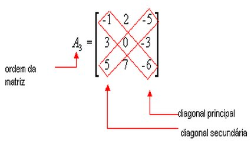

# Subdiagonais de uma matriz

## Contexto

A diagonal principal de uma matriz **A** é a coleção das entradas **A** i,j em que **i** é igual a **j**. A diagonal principal de uma matriz quadrada une o seu canto superior esquerdo ao canto inferior direito e a diagonal secundária une os demais cantos. Por exemplo, na matriz a seguir todos os elementos da diagonal principal são iguais a 1:

Em uma matriz de elementos inteiros 5x5, some todos os elementos da diagonal principal e subtraia da soma dos elementos da diagonal secundária.

## Entrada e saída

### Entrada

- Cinco linhas, cada uma com cinco números inteiros separados por espaços.

### Saída

* A soma dos elementos da diagonal principal menos a soma dos elementos da diagonal secundária.

## Exemplos

<!-- tests tests.toml --limit 3 -->
<table><tr><th><code>Entrada</code></th><th><code>Saída</code></th></tr>
<!-- INPUT --><tr><td valign="top"><pre>
1 0 1 1 0
0 1 1 1 1
0 0 1 0 0
1 1 1 0 0
1 0 1 1 1
</pre></td>
<!-- OUTPUT --><td valign="top"><pre>
0
</pre></td></tr>
<!-- INPUT --><tr><td valign="top"><pre>
1 1 0 0 1
1 1 1 0 0
1 0 0 1 1
0 1 1 1 1
0 0 0 1 1
</pre></td>
<!-- OUTPUT --><td valign="top"><pre>
2
</pre></td></tr>
<!-- INPUT --><tr><td valign="top"><pre>
2 4 6 3 9
8 7 5 4 1
5 2 6 1 7
8 4 3 2 5
9 7 6 5 3
</pre></td>
<!-- OUTPUT --><td valign="top"><pre>
-12
</pre></td></tr>
</table>
<!-- end -->
