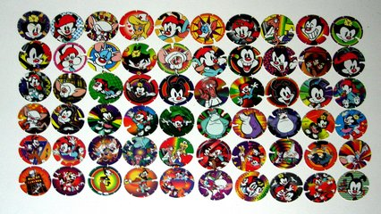

# Qual o mais repetido

## Contexto

Elvis Presley Da Silva tem uma coleção de tazos numerados. Ele colocou todos em ordem numérica, mas está na dúvida de qual tazo ele tem mais vezes repetido. Sua tarefa é criar um código que ajude Elvis a descobrir o número do tazo que se repete mais vezes. Se mais de um tazo empatar na quantidade máxima de repetições, todos eles devem ser impressos.

### Estratégias

- Seu código deve ter um único for e se utilizar do fato de os elementos estarem ordenados para fazer a contagem apenas na troca de valores.

### Entrada

- **Linha 1:** Um número inteiro positivo representando a quantidade de elementos no vetor (1 a 50).
- **Linha 2:** O vetor de inteiros em **ORDEM CRESCENTE**.

### Saída

- Os elementos que se repetem mais vezes no vetor, dentro de colchetes `[]` e separados por espaço.

## Exemplos

<!-- tests tests.toml --limit 4 -->
<!-- end -->
