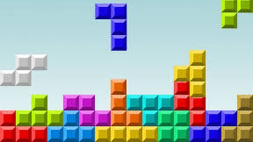

# Fazendo a peça do tetris cair

Você com certeza já jogou tetris. Ele é o jogo mais vendido do mundo com 170 milhões de unidades. Seja no seu celular ou no mini game de 70 joguinhos em um da vovó, Tetris é imbatível. Você fai simular a queda de um única peça de Tetris. Verifique se a peça não está colidindo com nada e faça-a descer uma posição.

### Entrada

- 1a linha: L C, sendo a quantidade de linhas e colunas do display. L, C tem valores em 1 e 20.
- linhas seguintes, o conteúdo do display com três caracteres apenas
  - . representa os espaços vazios
  - o representa a peça que cai
  - \# representam as peças que estão na base

### Saída

- O resultado do display. Se a peça estiver em colisão, reimprima
o display sem alteração.

## Exemplos

<!-- tests tests.toml --limit 3 -->
<table><tr><th><code> Entrada </code>
</th><th><code>  Saída  </code>
</th></tr><tr><td valign="top"><pre>
4 4
.#.#
.#o#
##o#
##o#
</pre></td><td valign="top"><pre>
.#.#
.#o#
##o#
##o#
</pre></td></tr></table>

<table><tr><th><code> Entrada </code>
</th><th><code>  Saída  </code>
</th></tr><tr><td valign="top"><pre>
4 4
ooo#
o.o#
o#o#
.#.#
</pre></td><td valign="top"><pre>
...#
ooo#
o#o#
o#o#
</pre></td></tr></table>

<table><tr><th><code> Entrada </code>
</th><th><code>  Saída  </code>
</th></tr><tr><td valign="top"><pre>
5 5
.....
..ooo
.#..o
###..
##.##
</pre></td><td valign="top"><pre>
.....
.....
.#ooo
###.o
##.##
</pre></td></tr></table>
<!-- end -->
