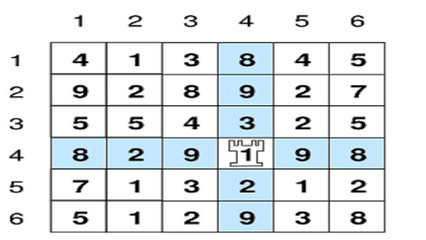

# Torre - OBI 2015 - Fase 2 - Nível 1

## Contexto

O peso de um cruzamento entre uma linha e uma coluna é a soma dos elementos dessa linha e dessa coluna, sem contar duas vezes o elemento do cruzamento. Neste problema, você deve encontrar o maior peso entre todos os cruzamentos.

No jogo de xadrez, a torre é uma peça que pode se mover para qualquer outra posição do tabuleiro na linha ou na coluna da posição que ela ocupa. O professor Paulo está tentando inventar um novo tipo de jogo de xadrez onde todas as peças são torres, o tabuleiro também é quadrado mas pode ter qualquer dimensão e cada posição do tabuleiro é anotada com um número inteiro positivo, como na figura abaixo.

Ele definiu o peso de uma posição (i,j) como sendo a soma de todos os números que estejam na linha i com todos os números da coluna j, mas sem somar o número que está exatamente na posição (i,j). Quer dizer, se uma torre estiver na posição (i,j), o peso da posição é a soma de todas as posições que essa torre poderia atacar.

O professor Paulo está solicitando a sua ajuda para implementar um programa que determine qual é o peso máximo entre todas as posições do tabuleiro.

No exemplo da figura acima, com um tabuleiro de dimensão seis (ou seja, seis linhas por seis colunas), o peso máximo é 67, referente à posição (4,4).

## Entrada e saída

### Entrada

- A primeira linha da entrada contém um inteiro **N**, representando a dimensão do tabuleiro.

- Cada uma das N linhas seguintes contém **N** inteiros positivos **X\_i**, definindo os números em cada posição do tabuleiro.

### Saída

- Seu programa deve produzir uma única linha, contendo um único inteiro, o peso máximo entre todas as posições do tabuleiro.

## Restrições

- 3 ≤ N ≤ 1000
- 0 < X\_i ≤ 100

## Informações sobre a pontuação

- Em um conjunto de casos de teste cuja soma é 60 pontos, N ≤ 300.

## Exemplos

<!-- tests tests.toml --limit 3 -->
<!-- end -->
