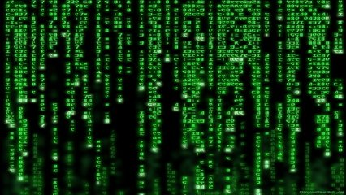

# Vogais e Consoantes - Substituindo

Sua tarefa é criar um programa que implemente a seguinte codificação: dada uma frase, substitua cada vogal por 'v', cada consoante por 'c' e mantenha os espaços.

### Entrada

- Uma frase de até **50** caracteres.

### Saída

- A frase codificada com **'v'** para vogais e **'c'** para consoantes.

### Restrições

- A frase terá no máximo **50** caracteres.
- A substituição deve ser insensível a maiúsculas e minúsculas (trate 'A' e 'a' como vogais, 'B' e 'b' como consoantes).
- Espaços devem ser preservados.

## Exemplos

<!-- tests tests.toml --limit 3 -->
<table><tr><th><code>Entrada</code></th><th><code>Saída</code></th></tr>
<!-- INPUT --><tr><td valign="top"><pre>
Pedrinho Marcio
</pre></td>
<!-- OUTPUT --><td valign="top"><pre>
cvccvccv cvccvv
</pre></td></tr>
<!-- INPUT --><tr><td valign="top"><pre>
Reumario Albrito
</pre></td>
<!-- OUTPUT --><td valign="top"><pre>
cvvcvcvv vcccvcv
</pre></td></tr>
<!-- INPUT --><tr><td valign="top"><pre>
AaBbCcDdEe
</pre></td>
<!-- OUTPUT --><td valign="top"><pre>
vvccccccvv
</pre></td></tr>
</table>
<!-- end -->
