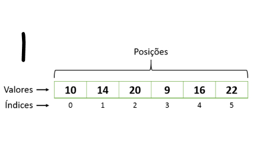

# Carregando vetor em várias linhas

Organizar dados em um vetor é uma tarefa comum em várias situações. Suponha que você esteja coletando informações sequenciais como medições, valores ou itens que precisam ser armazenados e acessados posteriormente. Para isso, é necessário ler os dados de forma organizada e mantê-los em uma estrutura de vetor, que pode ser manipulada ou exibida conforme necessário.

### Entrada

- A primeira linha contém um número inteiro **N** representando a quantidade de elementos.
- As próximas **N** linhas contêm os elementos que devem ser inseridos no vetor, um por linha.

### Saída

- Imprima os elementos do vetor, um por linha, na ordem de leitura.

### Restrições

- **0 ≤ N ≤ 1000** (O vetor pode ter de 0 a 1000 elementos)
- Cada elemento será um número inteiro.

## Exemplos

<!-- tests tests.toml --limit 3 -->
<table><tr><th><code>Entrada</code></th><th><code>Saída</code></th></tr>
<!-- INPUT --><tr><td valign="top"><pre>
3
1
2
3
</pre></td>
<!-- OUTPUT --><td valign="top"><pre>
1
2
3
</pre></td></tr>
<!-- INPUT --><tr><td valign="top"><pre>
0
</pre></td>
<!-- OUTPUT --><td valign="top"><pre>

</pre></td></tr>
<!-- INPUT --><tr><td valign="top"><pre>
1
6
</pre></td>
<!-- OUTPUT --><td valign="top"><pre>
6
</pre></td></tr>
</table>
<!-- end -->
